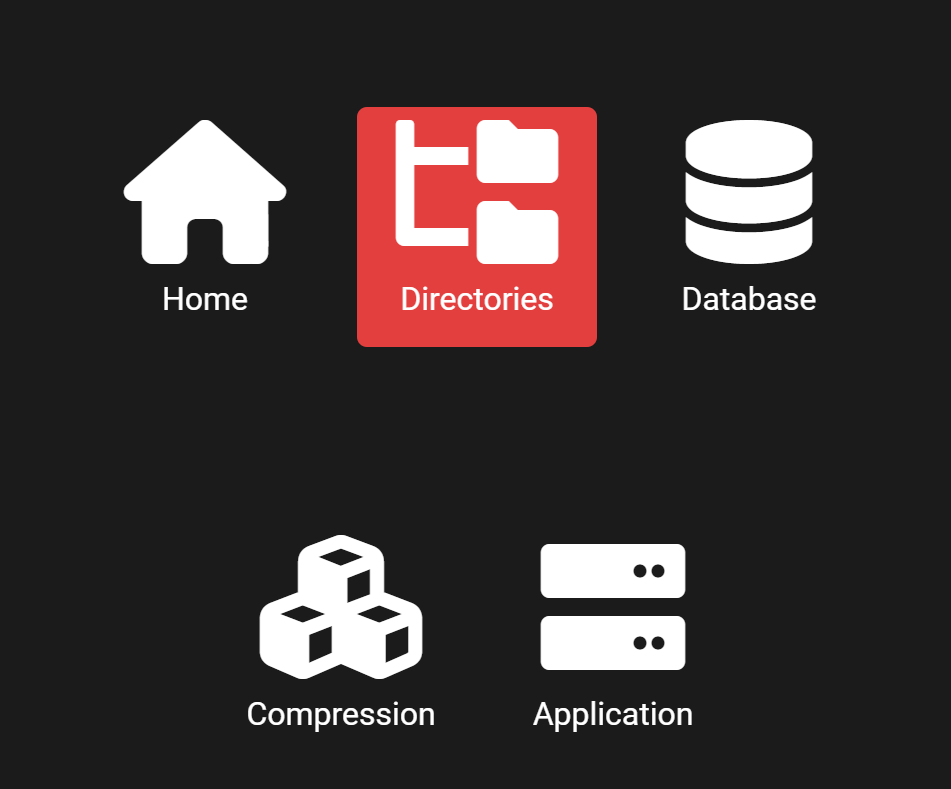
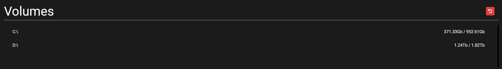
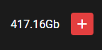

# Krympe Web Compression Interface
a simple and elegant solution for media server compression.

# Use Cases:
1) Plex / Emby / FlexxTV Media Servers
2) Any server with a lot of media files

# Documentation:

## Adding Watched Directories
1) Click the menu  

2) Open Directories Settings

3) Navigate through the volume list

4) Click the plus on the directory you want to watch

